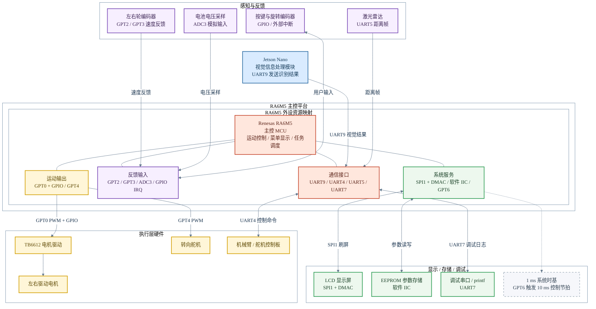

# RA6M5 硬件架构图（Mermaid）

```mermaid
%%{init: {
  'theme': 'base',
  'themeVariables': {
    'fontFamily': 'SimSun, Songti SC, serif',
    'fontSize': '16px',
    'primaryColor': '#ffffff',
    'primaryTextColor': '#18324d',
    'primaryBorderColor': '#3a5673',
    'lineColor': '#63788d',
    'secondaryColor': '#ffffff',
    'tertiaryColor': '#ffffff',
    'clusterBkg': '#ffffff',
    'clusterBorder': '#6c87a2'
  },
  'flowchart': {
    'nodeSpacing': 30,
    'rankSpacing': 40
  }
}}%%
flowchart TB
    classDef sensor fill:#f7efff,stroke:#7b4db7,stroke-width:2px,color:#3c2454;
    classDef core fill:#d9ebff,stroke:#2f6ea5,stroke-width:2px,color:#133956;
    classDef mcu fill:#ffe7dd,stroke:#c84b31,stroke-width:2px,color:#5a2217;
    classDef service fill:#edf8ee,stroke:#2f9d55,stroke-width:2px,color:#194026;
    classDef act fill:#fff6d8,stroke:#d3a007,stroke-width:2px,color:#5c4700;
    classDef note fill:#f6f7fb,stroke:#98a7b4,stroke-width:1.5px,color:#314252,stroke-dasharray: 5 5;

    subgraph SENSE["感知与反馈"]
        direction TB
        LIDAR["激光雷达<br/>UART5 距离帧"]:::sensor
        ENCODER["左右轮编码器<br/>GPT2 / GPT3 速度反馈"]:::sensor
        BAT["电池电压采样<br/>ADC3 模拟输入"]:::sensor
        KEYS["按键与旋转编码器<br/>GPIO / 外部中断"]:::sensor
    end

    JETSON["Jetson Nano<br/>视觉信息处理模块<br/>UART9 发送识别结果"]:::core

    subgraph PLATFORM["RA6M5 主控平台"]
        direction TB
        subgraph RA_MAP["RA6M5 外设资源映射"]
            direction TB
            RA["Renesas RA6M5<br/>主控 MCU<br/>运动控制 / 菜单显示 / 任务调度"]:::mcu
            COMM["通信接口<br/>UART9 / UART4 / UART5 / UART7"]:::mcu
            FEED["反馈输入<br/>GPT2 / GPT3 / ADC3 / GPIO IRQ"]:::sensor
            SYS["系统服务<br/>SPI1 + DMAC / 软件 IIC / GPT6"]:::service
            MOTION["运动输出<br/>GPT0 + GPIO / GPT4"]:::act
        end
    end

    subgraph EXEC["执行层硬件"]
        direction TB
        TB6612["TB6612 电机驱动"]:::act
        MOTORS["左右驱动电机"]:::act
        STEER["转向舵机"]:::act
        ARM["机械臂 / 舵机控制板"]:::act
    end

    subgraph SUPPORT["显示 / 存储 / 调试"]
        direction TB
        LCD["LCD 显示屏<br/>SPI1 + DMAC"]:::service
        EEPROM["EEPROM 参数存储<br/>软件 IIC"]:::service
        DEBUG["调试串口 / printf<br/>UART7"]:::service
        TICK["1 ms 系统时基<br/>GPT6 触发 10 ms 控制节拍"]:::note
    end

    KEYS ~~~ JETSON
    JETSON ~~~ RA
    MOTION ~~~ TB6612
    ARM ~~~ LCD

    RA --- COMM
    RA --- FEED
    RA --- SYS
    RA --- MOTION

    JETSON --> |UART9 视觉结果| COMM
    LIDAR --> |距离帧| COMM
    ENCODER --> |速度反馈| FEED
    BAT --> |电压采样| FEED
    KEYS <--> |用户输入| FEED

    COMM <--> |UART4 控制命令| ARM
    COMM <--> |UART7 调试日志| DEBUG
    SYS <--> |SPI1 刷屏| LCD
    SYS <--> |参数读写| EEPROM
    SYS -.-> TICK

    MOTION --> |GPT0 PWM + GPIO| TB6612
    TB6612 --> MOTORS
    MOTION --> |GPT4 PWM| STEER
```
