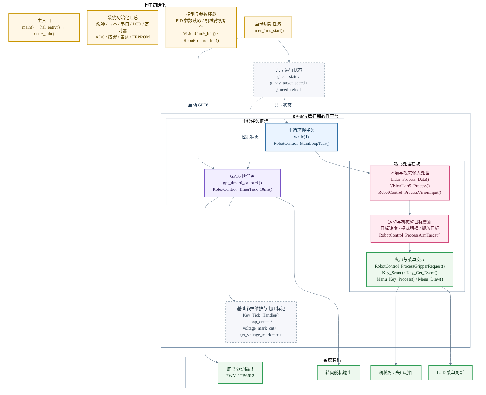

# RA6M5 软件流程图（Mermaid）

```mermaid
%%{init: {
  'theme': 'base',
  'themeVariables': {
    'fontFamily': 'SimSun, Songti SC, serif',
    'fontSize': '16px',
    'primaryColor': '#ffffff',
    'primaryTextColor': '#18324d',
    'primaryBorderColor': '#3a5673',
    'lineColor': '#63788d',
    'secondaryColor': '#ffffff',
    'tertiaryColor': '#ffffff',
    'clusterBkg': '#ffffff',
    'clusterBorder': '#6c87a2'
  },
  'flowchart': {
    'nodeSpacing': 28,
    'rankSpacing': 36
  }
}}%%
flowchart TB
    classDef init fill:#fff7e6,stroke:#c99500,stroke-width:2px,color:#5a4300;
    classDef main fill:#eaf4ff,stroke:#2f6ea5,stroke-width:2px,color:#123857;
    classDef fast fill:#f2eeff,stroke:#7754c6,stroke-width:2px,color:#33245a;
    classDef logic fill:#ffeaf1,stroke:#d1497b,stroke-width:2px,color:#5b1f34;
    classDef output fill:#edf8ee,stroke:#2f9d55,stroke-width:2px,color:#194026;
    classDef note fill:#f6f7fb,stroke:#98a7b4,stroke-width:1.5px,color:#314252,stroke-dasharray: 5 5;

    subgraph INIT["上电初始化"]
        direction LR
        ENTRY["主入口<br/>main() → hal_entry() → entry_init()"]:::init
        I1["系统初始化汇总<br/>缓冲 / 时基 / 串口 / LCD / 定时器<br/>ADC / 按键 / 雷达 / EEPROM"]:::init
        I2["控制与参数装载<br/>PID 参数读取 / 机械臂初始化<br/>VisionUart9_Init() / RobotControl_Init()"]:::init
        I3["启动周期任务<br/>timer_1ms_start()"]:::init
    end

    STATE["共享运行状态<br/>g_car_state / g_nav_target_speed / g_need_refresh"]:::note

    subgraph PLATFORM["RA6M5 运行期软件平台"]
        direction TB

        subgraph CORE["主控任务框架"]
            direction LR
            MAIN_LOOP["主循环慢任务<br/>while(1)<br/>RobotControl_MainLoopTask()"]:::main
            FAST_LOOP["GPT6 快任务<br/>gpt_timer6_callback()<br/>RobotControl_TimerTask_10ms()"]:::fast
        end

        subgraph PROC["核心处理模块"]
            direction LR
            P1["环境与视觉输入处理<br/>Lidar_Process_Data()<br/>VisionUart9_Process()<br/>RobotControl_ProcessVisionInput()"]:::logic
            P2["运动与机械臂目标更新<br/>目标速度 / 模式切换 / 抓放目标<br/>RobotControl_ProcessArmTarget()"]:::logic
            P3["夹爪与菜单交互<br/>RobotControl_ProcessGripperRequest()<br/>Key_Scan() / Key_Get_Event()<br/>Menu_Key_Process() / Menu_Draw()"]:::output
        end

        TICK["基础节拍维护与电压标记<br/>Key_Tick_Handler()<br/>loop_cnt++ / voltage_mark_cnt++<br/>get_voltage_mark = true"]:::note
    end

    subgraph OUT["系统输出"]
        direction LR
        O1["底盘驱动输出<br/>PWM / TB6612"]:::output
        O2["转向舵机输出"]:::output
        O3["机械臂 / 夹爪动作"]:::output
        O4["LCD 菜单刷新"]:::output
    end

    I3 --> STATE
    STATE ~~~ MAIN_LOOP
    MAIN_LOOP ~~~ FAST_LOOP
    P3 ~~~ TICK
    TICK ~~~ O1

    STATE -. 共享状态 .-> MAIN_LOOP
    STATE -. 控制状态 .-> FAST_LOOP
    I3 -. 启动 GPT6 .-> FAST_LOOP

    MAIN_LOOP --> P1
    P1 --> P2
    P2 --> P3
    FAST_LOOP --> TICK

    FAST_LOOP --> O1
    FAST_LOOP --> O2
    P3 --> O3
    P3 --> O4
```
